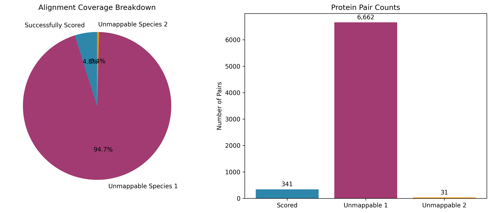
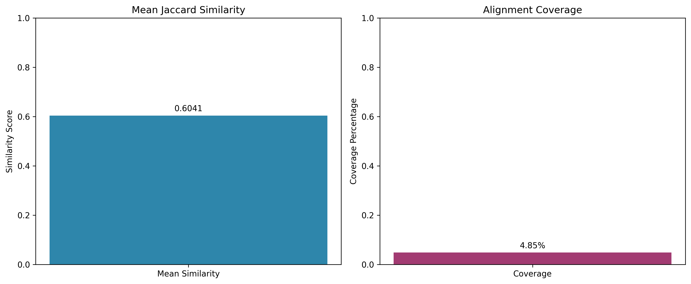
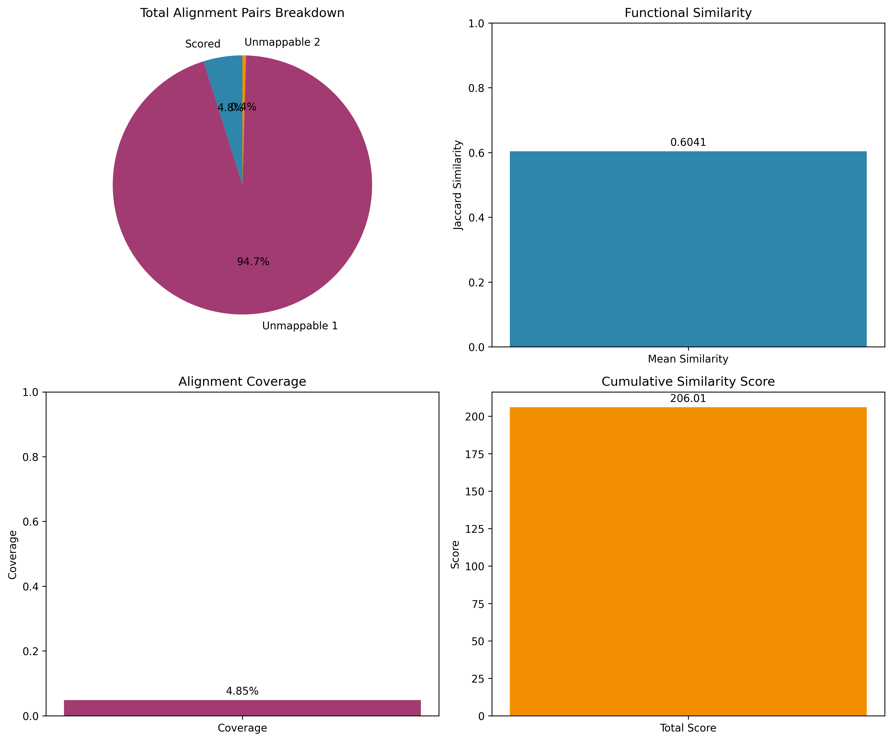

# Network Alignment Scorer

A bioinformatics tool for evaluating protein-protein interaction network alignments using Gene Ontology annotations.

## Overview

This project provides a comprehensive framework for scoring network alignments between different species by comparing the functional annotations (GO terms) of aligned proteins. The tool uses Jaccard similarity to measure the functional similarity between protein pairs, providing insights into the quality and biological relevance of network alignments.

## Context

Protein-protein interaction networks are crucial for understanding cellular processes and disease mechanisms. When comparing networks across species, alignment algorithms identify homologous proteins. However, the quality of these alignments needs validation. This tool addresses this by:

- **Functional Validation**: Using Gene Ontology annotations to assess biological relevance
- **Similarity Scoring**: Computing Jaccard similarity between GO term sets
- **Quality Assessment**: Providing comprehensive metrics and quality reports
- **Cross-Species Analysis**: Supporting comparisons between mouse (mmu), rat (rno), and human (hsa)

## Project Structure

```
scoring_network_alignments/
├── data/
│   ├── alignments/          # Network alignment files (.sif format)
│   ├── go_annotations/      # Gene Ontology annotation files
│   └── mappings/           # Protein ID mapping files
├── network_alignment_scorer/
│   ├── __init__.py
│   ├── scorer.py           # Main scoring module
│   └── plotter.py          # Visualization module
├── plots/                  # Generated visualization plots
├── requirements.txt        # Python dependencies
└── README.md
```

## Installation

1. Clone the repository:
```bash
git clone <repository-url>
cd scoring_network_alignments
```

2. Install dependencies:
```bash
pip install -r requirements.txt
```

## Usage

### Programmatic Usage

```python
from network_alignment_scorer import NetworkAlignmentScorer, AlignmentPlotter
from pathlib import Path

# Initialize scorer and plotter
scorer = NetworkAlignmentScorer()
plotter = AlignmentPlotter()

# Score alignment
results = scorer.score_alignment(
    alignment_file=Path("data/alignments/rno-mmu.sif"),
    go_file_1=Path("data/go_annotations/rno.go"),
    go_file_2=Path("data/go_annotations/mmu.go"),
    mapping_file_1=Path("data/mappings/rno.map"),
    mapping_file_2=Path("data/mappings/mmu.map")
)

# Generate visualizations
plotter.plot_coverage_breakdown(results, save_path="coverage_breakdown.png")
plotter.plot_similarity_distribution(results, save_path="similarity_distribution.png")
plotter.plot_quality_metrics(results, save_path="quality_metrics.png")

# Get quality report
report = scorer.get_quality_report(results)
print(report)
```

## Results

### Rat-Mouse Alignment Analysis

```
Network Alignment Quality Report
================================

Alignment Statistics:
- Total alignment pairs: 7,034
- Successfully scored pairs: 341
- Coverage: 4.85%
- Unmappable proteins (species1): 6,662
- Unmappable proteins (species2): 31

Similarity Scores:
- Total score: 206.0081
- Mean similarity: 0.6041

Quality Assessment:
- Overall Quality: GOOD
- Coverage: NEEDS IMPROVEMENT
```

### Visualization Results

#### Coverage Breakdown


*The pie chart shows the distribution of alignment pairs: only 4.85% (341 pairs) were successfully scored, while 94.7% of rat proteins and 0.4% of mouse proteins could not be mapped to GO terms.*

#### Similarity Metrics


*The mean Jaccard similarity of 0.6041 indicates good functional conservation between successfully mapped protein pairs, while the low coverage highlights data integration challenges.*

#### Comprehensive Quality Metrics


*The comprehensive view shows the breakdown of alignment pairs, functional similarity scores, coverage percentages, and cumulative similarity scores for the rat-mouse alignment.*

### Analysis Notes

The results show several important findings:

1. **Data Mapping Challenges**: The low coverage (4.85%) indicates significant challenges in mapping protein IDs between the alignment file and GO annotation files.

2. **Species-Specific Issues**: 
   - 6,662 rat proteins could not be mapped to GO terms (94.7% of rat proteins)
   - Only 31 mouse proteins could not be mapped (0.4% of mouse proteins)
   - This suggests the rat mapping file may have ID format mismatches

3. **Functional Similarity**: When proteins can be successfully mapped, they show good functional conservation with a mean Jaccard similarity of 0.6041, indicating strong biological relevance in the alignment.

4. **Quality Assessment**: 
   - The GOOD overall quality reflects the high functional similarity of successfully mapped proteins
   - The NEEDS IMPROVEMENT coverage indicates data integration issues rather than algorithmic problems

5. **Biological Insights**: The 341 successfully scored pairs represent high-confidence functional alignments between rat and mouse proteins, providing valuable insights into conserved biological processes.

## Methodology

### Jaccard Similarity

The tool uses Jaccard similarity to measure functional similarity between protein pairs:

```
Jaccard(A,B) = |A ∩ B| / |A ∪ B|
```

Where A and B are sets of GO terms for aligned proteins.

### Quality Metrics

- **Coverage**: Percentage of alignment pairs successfully scored
- **Mean Similarity**: Average Jaccard similarity across all scored pairs
- **Unmappable Proteins**: Count of proteins without GO annotations

## Data Sources

- **Network Alignments**: Protein-protein interaction network alignments in SIF format
- **GO Annotations**: Gene Ontology annotations from UniProt/Ensembl
- **Protein Mappings**: ID mappings between different protein identifier systems

## Dependencies

- Python 3.8+
- pandas
- numpy
- matplotlib
- pathlib (built-in)

